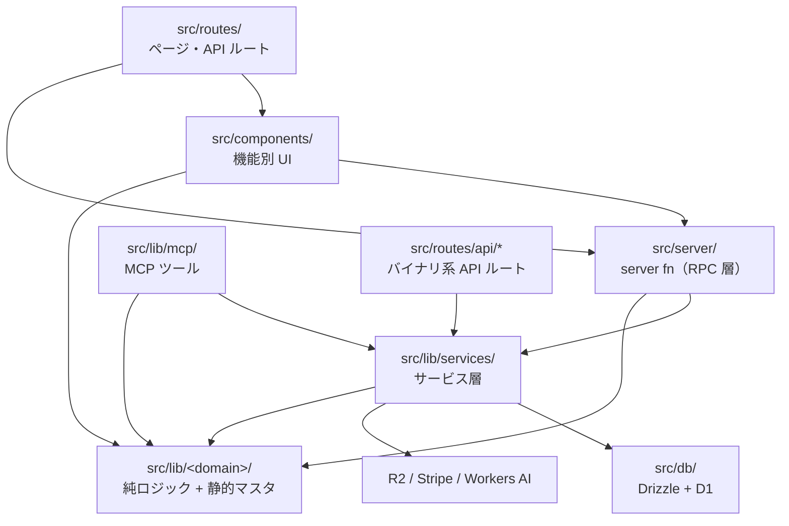

# アーキテクチャとドメインモデリング

ワインの AOP（原産地呼称）を地図で学ぶ Web アプリのリポジトリ構成・アーキテクチャ・ドメインモデリングのルールをまとめる。個別領域の詳細は [docs/deployment.md](./deployment.md)（CD/マイグレーション・環境）、[docs/ai-credit-system.md](./ai-credit-system.md)（AI クレジット）、[docs/geodata.md](./geodata.md)（ジオデータ生成）、[README.md](../README.md)（セットアップ）、[CLAUDE.md](../CLAUDE.md)（開発フロー）を参照。

## 技術スタック

| 分類 | 採用技術 |
|---|---|
| ランタイム | Cloudflare Workers（Node.js ではない。タスクランナーは Bun） |
| フレームワーク | TanStack Start（React 19 + TanStack Router ファイルベースルーティング + SSR） |
| データ取得 | TanStack Query（SSR 統合: `@tanstack/react-router-ssr-query`） |
| DB | Cloudflare D1（SQLite）+ Drizzle ORM |
| ストレージ | Cloudflare R2（binding: `AVATARS`。アバターとワイン写真を共用） |
| AI | Cloudflare Workers AI（binding: `AI`。地域 Q&A・エチケット解析） |
| 認証 | better-auth（email+password、stripe / mcp / admin プラグイン） |
| 課金 | Stripe（`@better-auth/stripe`。リソースは terraform/ で IaC 管理） |
| MCP | `@modelcontextprotocol/sdk` + `@mcp-ui/server`（`/api/mcp`、OAuth 2.1） |
| 地図 | MapLibre GL JS + 自前生成の GeoJSON（INAO / EU PDO オープンデータ由来） |
| UI | Tailwind CSS v4 + shadcn/ui（new-york / zinc、`src/components/ui/`） |
| 検証・整形 | TypeScript strict（`tsc`）/ Biome（タブ・ダブルクォート）/ Vitest（jsdom） |

## ディレクトリ構成

```
wine/
├── .claude/                # Claude Code 用フック（Stop 時 typecheck+check 強制）と skills
├── .github/workflows/      # CI（typecheck/check/test/マイグレーション適用検証）、Terraform CI/CD
├── docs/                   # 設計・運用ドキュメント
├── drizzle/                # D1 マイグレーション（手書きの連番 SQL。0000〜）
├── public/
│   └── data/aop/           # 生成済み GeoJSON（AOP 境界・地方/地区輪郭）。生成物だがコミットする
├── scripts/                # ジオデータ生成スクリプト（build-*.mjs）
├── src/
│   ├── routes/             # ファイルベースルーティング（ページ + API ルート + .well-known + embed）
│   ├── components/         # UI コンポーネント（ui/=shadcn、他は機能別サブフォルダ）
│   ├── server/             # createServerFn による RPC 層（認可 + zod 検証 + サービス委譲のみ）
│   ├── lib/
│   │   ├── wine/           # ★静的ドメインデータ層（AOP マスタ・地域・品種・格付け）
│   │   ├── quiz/           # クイズ純ロジック（ジェネレータ・スケジューラ・キー）
│   │   ├── billing/ credit/ dashboard/ drunk-wine/ admin/ ads/ ai/ reference-link/
│   │   │                   # 各ドメインの DB 非依存の純ロジック + zod スキーマ + テスト
│   │   ├── services/       # サービス層（D1/R2/Stripe/Workers AI への唯一のアクセス点）
│   │   ├── mcp/            # MCP サーバー（ツール・スキーマ・埋め込み UI）
│   │   ├── auth.ts         # better-auth サーバー構成（trustedOrigins・プラグイン）
│   │   └── auth-client.ts  # better-auth クライアント
│   ├── db/                 # Drizzle スキーマ（schema.ts=ドメイン、auth-schema.ts=better-auth）と db インスタンス
│   └── integrations/       # TanStack Query / better-auth のシェル接続部
├── terraform/              # Stripe リソースの IaC（state は R2）。Cloudflare リソースは管理外
├── wrangler.jsonc          # Workers 設定（トップレベル=本番 wine、env.preview=wine-preview）
├── vite.config.ts          # アプリ用 Vite 設定（cloudflare + tanstackStart プラグイン）
└── vitest.config.ts        # テスト専用の別設定（Cloudflare プラグインを意図的に読まない）
```

## レイヤリングと依存方向

依存は常に一方向。上の層が下の層を呼び、逆流しない。



各層の責務:

1. **`src/routes/`（ページ / HTTP 境界）** — ページルートは `beforeLoad` で認証ガード（`getSession()` サーバ関数）、`loader` でデータ取得。API ルートは `createFileRoute` の `server.handlers` で Web 標準 Response を返す。
2. **`src/server/`（RPC 層）** — `createServerFn` の薄い層。各関数は (a) `middleware([authMiddleware | adminMiddleware | optionalAuthMiddleware])` で認可、(b) `inputValidator(zod スキーマ)` で入力検証、(c) `handler` でサービス層への 1 行委譲、の 3 点だけを持つ。**ビジネスロジックと DB アクセスをここに書かない**。`userId` は必ず `context.user.id` から取り、クライアント申告の値を信用しない。
3. **`src/lib/services/`（サービス層）** — D1（`#/db`）・R2（`env.AVATARS`）・Stripe・Workers AI（`env.AI`）に触れる**唯一の層**。全関数が操作主体の `userId` を第 1 引数で受ける規約。Web の server fn と MCP ツール（`src/lib/mcp/tools.ts`）とバイナリ系 API ルートがこの層を共用する。判定・換算ロジックは持たず「D1 との薄い橋渡し」に徹する。
4. **`src/lib/<domain>/`（純ロジック層）** — DB・`cloudflare:workers` 非依存の純関数と静的マスタデータ。**jsdom 上の単体テスト（`*.test.ts`）はこの層にのみ置かれる**。テストしたいロジックは基本この層へ切り出す（`cloudflare:workers` を import するモジュールは vitest(jsdom) でロードできないため）。

   なお D1・`env` に触れる層（`src/lib/services/*` の生SQL断片や `src/lib/mcp/tools.ts` のハンドラ）は、**`@cloudflare/vitest-pool-workers` を使う `*.workers.test.ts`** で workerd 上に実D1(miniflare)を用意して検証する（`vitest.config.ts` の `workers` プロジェクト。マイグレーションは `test/apply-migrations.ts` が適用）。純ロジックに切り出せない「実際にクエリを走らせないと守れない挙動」（onConflict の加算・streak リセット・case-when 集計など）はこちらでテストする。テストは分離D1を使い本番/プレビューには触れない。

grep で実測済みの規則: `#/db` を runtime import するのは `lib/services/*` と `lib/auth.ts` のみ。`lib/services` から `#/server` への import は 0 件。components からサービス層への import は `import type` のみ。

**構造的な例外**（「lib は server/services に依存しない」が当てはまらないもの）:

- `src/lib/mcp/tools.ts` — MCP はサーバーエントリポイントなのでサービス層を runtime import する（入力スキーマは `schemas.ts` に分離してランタイム非依存を維持）。
- `src/lib/credit/use-credit.ts` / `src/lib/billing/use-billing.ts` — `#/server` の server fn を useQuery で包むクライアント側フック。
- `src/lib/auth.ts` — better-auth 構成で D1 に直結する。

### サーバーへの入口は 3 系統

| 入口 | 認証方法 | 用途 |
|---|---|---|
| `src/server/*.ts`（server fn） | `src/server/middleware.ts` の 3 ミドルウェア | 通常の RPC（JSON シリアライズ可能な入出力） |
| `src/routes/api/*`（API ルート） | ハンドラ内で `auth.api.getSession({ headers })` を自前実行 | バイナリ（FormData: 写真・ラベル解析・アバター）、公開 JSON、R2 配信、better-auth 委譲 |
| `src/lib/mcp/tools.ts`（MCP ツール） | `/api/mcp` の `withMcpAuth`（OAuth Bearer → セッション） | MCP クライアント向け |

3 系統とも最終的に同じサービス層を呼ぶ。server fn の middleware と API ルートの認証は**別系統**なので混同しない。

## フロントエンド

- **ルーティング**: フラットルート + ドット区切りで `src/routes/` 直下に置く（`cellar.$entryId.edit.tsx` → `/cellar/:entryId/edit`）。動的セグメントは `$param`、スプラットは `$.ts`、特殊文字は `[.]well-known` のようにエスケープ。`routeTree.gen.ts` は自動生成・手編集禁止。
- **状態モデル**: 「**URL = 共有可能な状態、ローカル state = エフェメラルな状態**」。共有すべきページ状態（選択 AOP・フィルタ等）は zod の `validateSearch` で型付けして URL に載せ、既定値はパラメータ省略で表現する。クイズの出題キューや地図の掘り下げ履歴などは意図的に URL に載せない。不正値は `.catch()` で黙って捨てる。
- **認証ガード**: 認証必須ページは `beforeLoad` で `getSession()` → 未ログインは `/login` へ redirect。`/admin` は非管理者に存在を悟らせず `/` へ黙って redirect する。`beforeLoad` で注入する認証状態は SSR 時点のスナップショットで、リアルタイムには `authClient.useSession` を使う。
- **データ取得**: 静的ワインデータは loader から直接 import して返す（server fn を介さない）。ユーザ固有データは server fn を loader で await するか、`use-*` フック（useQuery。queryKey は定数 export し invalidate 側でも同じ定数を使う）で取得する。
- **UI**: shadcn/ui（`src/components/ui/`、追加は `pnpm dlx shadcn@latest add <name>`）を土台に、機能別コンポーネントは `src/components/<feature>/` に置く（フックや純ロジックも同居可）。UI 文言は日本語。ナビゲーションは `<Button asChild><Link/></Button>` が定型。
- **シェル**: `__root.tsx` が `<html>` 全体を描画（PWA meta・FOUC 防止のテーマ初期化スクリプト・Header・AdBanner・コマンドパレット常駐）。`/embed/*` は MCP Apps の iframe 用で「Header 非表示・認証不要・選択状態を URL に載せない」の 3 制約がある。

## ドメインモデリングのルール

### 大原則: 静的マスタと D1 ユーザ状態の分離

コンテンツデータ（AOP・地域・品種・格付け）は **`src/lib/wine/` の静的ファイル**で持ち、**D1 にはユーザ固有の状態だけ**を保存する。この分担が全ドメイン設計の前提になっている。

- 静的マスタへの参照（`drunk_wine.aopId`、`grapeVarietyIds` 等）は文字列で FK を張れないため、**存在検証はサービス層の責務**（`getAop()` / `getVariety()` で必ず検証する）。
- クイズは問題テーブルを持たず、静的データから問題を生成する（後述）。

### AOP 静的ドメイン（`src/lib/wine/`）

アプリの核。フランス 7 地方 + イタリア 2 州、約 500 件の AOP/DOC(G) エントリを `aops.json` にキュレーションする。

- **真実の源の一元化**: AOP 本体= `aops.json`、品種= `varieties.ts`、格付けタグ語彙= `tags.ts`、地域・地区= `regions.ts`。マスタから ID の enum（`REGION_IDS` / `GRAPE_VARIETY_IDS` / `AOP_TAG_IDS`）を導出し、zod スキーマ（`aop-schema.ts`）が enum 参照で**参照切れをモジュール読み込み時に検出**する（壊れたデータは import した瞬間に落ちる）。新しい品種・タグ・地区は先にマスタへ登録しないと弾かれる。
- **`kind` は格付けではない**: `AopKind`（regional / village / vineyard / winery）は「何を指す呼称か」の区分。格付け（特級・一級・1855 等）は地域によって畑・村・シャトーのどれが対象か変わるため、**直交する `tags` で表現**する。格付けタグは 1 AOP につき高々 1 つ（テストで強制）。
- **「クリマである」と「AOC である」も直交**: 法的アペラシオンかどうかは `isLegalAppellation()` が唯一の権威（モンラシェ=クリマかつ単独 AOC、シャブリのレ・クロ=クリマだが非 AOC）。`kind` から AOC かどうかを推論するコードを書かない。
- **`idApp` の帯規約**: GeoJSON との結合キー。INAO の実値のほか、実体のないエントリには地域ごとの合成 ID 帯（900001〜シャンパーニュ格付け村、910001〜ボルドー、920001〜/921001〜イタリア、930001〜ブルゴーニュのクリマ・合成総称ノード等。詳細は `types.ts` のコメント）を割り当てる。**`idApp >= 930000`（`POLYGONLESS_IDAPP_MIN`）はポリゴンを持たない帯**で、ジオデータ生成・整合テストの対象外。この定数は `scripts/*.mjs` 側に同値リテラルで複製されており、変更時は複数箇所の同期が必要。
- **階層は木ではなく DAG**: `villageAopIds`（畑・シャトー→所属村。複数村にまたがる畑は複数持てる、winery はちょうど 1 つ）と `parentAopId`（個別クリマ→親の総称 AOC。持つ場合 `villageAopIds` は持てない）でリンクする。相関制約は zod の `superRefine` とテストの両方で強制。
- **整合性テストがモデリングルールの実体**: `data-integrity.test.ts` が id/idApp の一意性・参照の有効性・格付けタグの排他性・GeoJSON との 1:1 対応・件数スナップショットを回帰固定する。データ追加時は件数スナップショットの期待値を意図的に更新する運用。
- **ジオデータは生成物をコミット**: `scripts/build-*.mjs` が INAO / EU PDO オープンデータから `public/data/aop/*.geojson` と `aop-centroids.json` を生成する（手順は [docs/geodata.md](./geodata.md)）。GeoJSON を再生成したら `bun run build:centroids` も必ず実行し、bounds は `regions.ts` に手で反映する。GeoJSON のフィーチャ順は描画順・クリック解決を兼ねる契約なので並びを変えない。

### クイズドメイン（`src/lib/quiz/`）

- **問題キーが第一級のドメイン概念**: 問題の同一性は「テストされる事実」を表す安定キー文字列（例 `variety:gamay:morgon`）。コロン区切り・全セグメント `[a-z0-9-]`・**末尾セグメントは常に subject（正解）AOP の slug**・最大 120 文字。実績（`quiz_question_stat`）はキー単位で集計されるため、**既存キーのフォーマット変更は全ユーザの実績喪失を意味する**（後方互換を保つ）。
- **ジェネレータは純関数のペア**: 各形式が `enumerate*Keys(regionId)`（成立する全キーの決定的列挙。結果はメモ化）と `materialize*Question(parsed, rng)`（キー + 注入乱数 → 問題 or null）を公開する。乱数は必ず `Rng` 引数を使い `Math.random` を直呼びしない（テストは `mulberry32` 固定シードで決定的に検証）。正解一意性は選択肢構成のロジックで構成的に保証し、materialize 時に事実を再検証して失効キーは null で返す（throw しない契約）。
- **`answerIsAop` フラグ**: 「設問の主語が AOP」か「AOP は 4 択の正解にすぎない」かの二分法で、地図の関連クイズのスコープ・進捗の分母・分子の 3 箇所の挙動を同時に決める。新形式追加時に最も慎重に選ぶフィールド。
- **スケジューリング**: SRS 風の優先度スコア（未出題 > 直近不正解 > 忘却した正解 > 直近正解）+ 重み付き抽選の純関数（`scheduler.ts`）。通常モードは「一度も正解していない問題」だけを出題し全問正解で完了、`includeSolved` で再チャレンジ。
- **新形式の追加手順**は `types.ts` の `QUIZ_TYPES` 登録 → `keys.ts` にキー形式 → `generators/<id>.ts` → `generators/index.ts` のレジストリ登録（型で網羅強制）→ 全数スイープの `*.test.ts`。server fn・設定画面・進捗集計は自動追従し、**DB マイグレーション不要**。

### D1 スキーマ規約（`src/db/schema.ts`）

- ドメインテーブルは `schema.ts`、better-auth 系（user/session/oauth_*/subscription）は `auth-schema.ts`（プラグインのモデル名/エクスポート名と一致必須）。テーブルごとに「なぜこの設計か」を JSDoc で書くのが慣習。
- **ID は `crypto.randomUUID()` の text PK**（連番は使わない。`drunk_wine` は写真 URL の推測不能性がこの ID に依存するため特に変更禁止）。
- タイムスタンプは integer `{ mode: "timestamp_ms" }` + `unixepoch('subsecond')` ミリ秒デフォルト + `$onUpdate`。**日付・月のキーは JST 基準の text**（`"YYYY-MM-DD"` / `"YYYY-MM"`。`jstDayKey` / `currentMonthKey`。UTC で計算すると集計がずれる）。JSON カラムは `{ mode: "json" }` + `.$type<T>()`。
- user への FK は `onDelete: "cascade"`。ただし**監査ログ（`admin_audit_log`）と `subscription.referenceId` は証跡保全のため意図的に FK を張らない**。
- D1 に**トランザクションはない**。複数書き込みの原子性は `db.batch([...])` で確保し、冪等性は unique 制約付き `requestId` + 条件付き UPDATE で担保する。この不変条件を崩す書き込みパス（batch 外での残高更新等）を追加しない。
- 所有権チェックは常に `WHERE id AND userId` の複合条件で行い、「存在しない」と「他ユーザ所有」を同一エラー（"Entry not found"）にして存在探索を防ぐ。
- 更新入力は「**undefined = 変更しない / null = クリア**」の規約（drizzle が undefined キーを無視する性質を利用。`drunk-wine/schema.ts` が単一情報源）。

### クレジット・課金ドメイン

- **会員区分は導出値**: DB に plan カラムは持たず、better-auth/stripe の `subscription` テーブルから `resolvePlan()`（`entitlements.ts`）で `"free" | "premium"` を導出する。プラン・料金・クレジット数値は `plans.ts` に集約。
- **クレジットは「追記専用台帳 + 残高キャッシュ」**: `credit_ledger`（unique な `requestId` が冪等キー）と `credit_balance` を同一 `db.batch` で更新。残高は `WHERE balance >= required` の条件付き UPDATE でのみ減算し、負値を構造的に禁止。残高不足は throw せず `{ blocked: true }` を返す（アップグレード誘導 UI につなげるため）。
- **月次付与は Cron ではなく遅延付与**: 残高参照・消費の入口で必ず `ensureCurrentMonthGranted` を呼ぶ。繰越なし。管理画面のような「閲覧が付与を起こしてはいけない」文脈では `credit_balance` を生 SELECT する（`admin-service.ts`）。
- **AI 消費の骨格**: `reserveCredits`（見積で予約）→ `env.AI.run` → `settleReservation`（実測で確定）/ 失敗時 `refundReservation`（全額返却して再 throw）。クレジットを消費する新機能は必ずこのパターンに従い、`requestId` に用途プレフィックス付き一意キーを使う。
- 管理画面の金銭的操作は理由必須 + `admin_audit_log` への記録をセットにし、可能な限り `requestId` で冪等化する（プレミアム延長は例外的に非冪等で、UI 側の二重送信防止に依存）。

### MCP サーバー（`src/lib/mcp/`）

- `/api/mcp` は Streamable HTTP・ステートレス・POST のみ。**リクエストごとに `buildMcpServer(userId)` と transport を新規生成**する（SDK が再利用を禁止）。OAuth 2.1 は better-auth の `mcp` プラグインが担い、ディスカバリは `src/routes/[.]well-known/` の 2 ルート（サイトルート直下必須）。
- ツール追加のルール: 入力スキーマは `schemas.ts` に zod の **raw shape**（`z.object()` で包まない）として置きランタイム非依存を保つ / ペイロードのキーは MCP 境界では snake_case（サービス層の camelCase との変換は `tools.ts` が単一情報源）/ ID 参照はサービス呼び出し前に静的マスタで存在検証 / 結果は `ok()` / `err()` ヘルパで統一 / URL は `env.BETTER_AUTH_URL` 起点の絶対 URL。
- 埋め込み UI（`show_aop_map` / `register_drunk_wine`）は MCP Apps (SEP) と mcp-ui の**二重対応**。プライベートな ID は externalUrl に載せず rawHtml を使う（IDOR 防止）。ブリッジ HTML のセキュリティ規約（postMessage の送信元検証・origin 厳密比較）は `apps.test.ts` で固定されている。
- **MCP 関連ファイルを変更したら `mcp-inspector-verify` skill による実機確認が必須**（CLAUDE.md 規定）。

## インフラ・デプロイ

- **環境**: 本番 = Worker `wine`（D1 `wine-db`、カスタムドメイン https://wine.nibo.sh ）、プレビュー = Worker `wine-preview`（PR ごとに `https://<branch>-wine-preview.niboshi.workers.dev`）。**プレビューの D1/R2 は全 PR で共有**され、PR のマイグレーションはマージ前にプレビュー共通 DB へ先行適用される。
- **CD は Cloudflare Workers Builds**（GitHub Actions ではない）。deploy command がビルド成功後・デプロイ直前に `db:migrate:remote` / `db:migrate:preview` を自動実行する。build/deploy command はダッシュボード（または Workers Builds API）にのみ保存され、リポジトリにはない（docs/deployment.md）。
- **マイグレーションは手書きの連番 SQL**を `drizzle/` に追加する。`drizzle-kit` は使わない（追跡対象が auth-schema.ts を含まず破壊的差分を提案しうるため、依存ごと削除済み）。`--> statement-breakpoint` 区切り、`IF NOT EXISTS` 付き（プレビュー共通 DB への冪等適用のため）、既存ファイルは書き換えず必ず新しい連番を積む。CI がゼロから適用可能かを検証する。破壊的なスキーマ変更（列・テーブルの削除/リネーム、NOT NULL 追加等）は expand-and-contract で 2 段階のデプロイに分ける（詳細は CLAUDE.md）。
- **CI**（`.github/workflows/ci.yml`）: typecheck（tsc）→ check（Biome）→ build（Vite）→ test（Vitest）→ `db:migrate:local`。マージ前チェックはローカルで `bun run typecheck` / `check` / `build` / `test`。
- **Terraform** は Stripe リソースのみ管理（state は R2、preview は自動 apply / production は手動）。Cloudflare リソースは wrangler.jsonc とダッシュボード管理。
- **公開ドメインを追加・変更したら `src/lib/auth.ts` の `trustedOrigins` に登録する**（プレビューはダッシュ連結ホスト名用のワイルドカード `https://*-wine-preview...` が別途必要）。
- binding や vars を wrangler.jsonc に追加したら `bun run cf-typegen`、wrangler types が生成しないシークレットは `src/env-secrets.d.ts` に型を足す。

## 横断規約

- **import**: エイリアスは `#/*` = `./src/*`（package.json の Node subpath imports）。tsconfig に `@/*` も残っているが使用 0 件のデッドエントリで、新規コードは `#/` を使う。相対 import は同一ドメインディレクトリ内のみ（`../../` 越えは禁止相当。現状 0 件）。
- **テスト**: Vitest（jsdom）。テストは対象と同ディレクトリの co-located `*.test.ts` で、**原則として `src/lib/<domain>/` の純ロジックに置く**（モックが要らないようロジックを純関数へ分離するのが規約。サービス層・server fn のテストは書かない）。複雑な UI フックは例外的にコンポーネント側でもテストする — `src/components/quiz/useQuizSession.test.ts` が例で、Cloudflare 依存を引き込む server fn とルーターを `vi.mock` し、`@testing-library/react` の `renderHook` で検証する。`describe`/`it` のタイトルは日本語。vitest.config.ts は vite.config.ts と意図的に分離されている（Cloudflare プラグインが vitest 起動を壊すため）。
- **整形・lint**: Biome（タブインデント・ダブルクォート・organizeImports）。`routeTree.gen.ts` と `styles.css` は対象外。TypeScript は strict + `noUncheckedIndexedAccess` + `verbatimModuleSyntax`（型 import は `import type` 必須）等。
- **言語**: 識別子・ファイル名は英語、コメントは設計理由（why)を日本語で書く文化。UI 文言・zod の `.describe()`・MCP ツールの description・ドキュメントも日本語。エラーメッセージは英語（"Unauthorized" 等）。
- **定数の一元管理**: 上限値などの数値定数はドメイン lib に置き、zod スキーマ・サービス層・UI の全員が同じ定数を import する（二重管理禁止）。
- **開発フロー**: `bun run db:migrate:local`（初回・スキーマ変更後）→ `bun run dev`。マージ前に `bun run typecheck` / `check` / `build` / `test`。`.claude/hooks/stop-check.sh` が typecheck+check 未通過での Claude Code セッション終了をブロックする。PR には実装プラン（details タグ）と Test Plan を記載し、ブラウザ実機確認 + Gyazo スクリーンショットを添付する（CLAUDE.md）。

## 新しい機能ドメインを追加するときの定型

1. **純ロジック** — `src/lib/<domain>/` に zod スキーマ（`schema.ts`）・定数・計算ロジックを純関数で置き、同ディレクトリに `*.test.ts` を書く。
2. **DB** — テーブルが要るなら `src/db/schema.ts` に JSDoc 付きで定義し、`drizzle/` に連番 SQL を追加（上記スキーマ規約に従う）。
3. **サービス層** — `src/lib/services/<domain>-service.ts`。第 1 引数 `userId`、静的マスタ参照の存在検証、Row をそのまま返さず Entry 型（Date → epoch ms）に整形。
4. **RPC** — `src/server/<domain>.ts` に `createServerFn`（参照=GET / 更新=POST、middleware + `inputValidator` + 1 行委譲）。ファイル冒頭に認可方針を日本語コメントで書く。
5. **UI** — `src/routes/` にページ、`src/components/<domain>/` にコンポーネント。取得は `use-*` フック（queryKey 定数 export）か loader、更新は useMutation + `invalidateQueries`。
6. **MCP に公開する場合** — `schemas.ts` に raw shape、`tools.ts` にツール追加、変更後は `mcp-inspector-verify` で実機確認。
