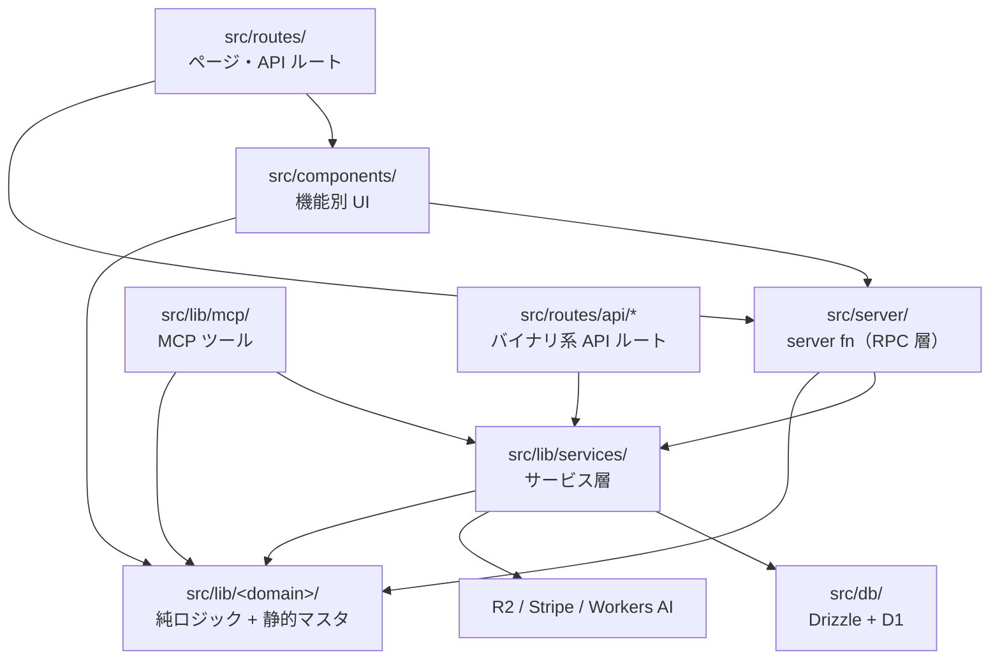

# アーキテクチャとドメインモデリング

ワインの AOP（原産地呼称）を地図で学ぶ Web アプリのリポジトリ構成・アーキテクチャ・ドメインモデリングのルールをまとめる。個別領域の詳細は [docs/deployment.md](./deployment.md)（CD/マイグレーション・環境）、[docs/ai-credit-system.md](./ai-credit-system.md)（AI クレジット）、[docs/geodata.md](./geodata.md)（ジオデータ生成）、[README.md](../README.md)（セットアップ）、[CLAUDE.md](../CLAUDE.md)（開発フロー）を参照。

## 技術スタック

| 分類 | 採用技術 |
|---|---|
| ランタイム | Cloudflare Workers（Node.js ではない。タスクランナーは Bun） |
| フレームワーク | TanStack Start（React 19 + TanStack Router ファイルベースルーティング + SSR） |
| データ取得 | TanStack Query（SSR 統合: `@tanstack/react-router-ssr-query`） |
| DB | Cloudflare D1（SQLite）+ Drizzle ORM |
| ストレージ | Cloudflare R2（binding: `AVATARS`。アバターとワイン写真を共用） |
| AI | Cloudflare Workers AI（binding: `AI`。地域 Q&A・エチケット解析）。エチケット解析はシークレット `OPENAI_API_KEY`（GPT-5.6 Luna）/ `ANTHROPIC_API_KEY`（Claude）設定時のみ LLM + web検索の高精度経路を優先し、キー未設定・失敗時は Workers AI へフォールバック。どの経路を走らせるかは `resolveLabelRoute`（`src/lib/ai/config.ts`）が SSOT |
| 認証 | better-auth（email+password、stripe / mcp / admin プラグイン） |
| 課金 | Stripe（`@better-auth/stripe`。リソースは terraform/ で IaC 管理） |
| MCP | `@modelcontextprotocol/sdk` + `@mcp-ui/server`（`/api/mcp`、OAuth 2.1） |
| 地図 | MapLibre GL JS + 自前生成の GeoJSON（INAO / EU PDO オープンデータ由来） |
| UI | Tailwind CSS v4 + shadcn/ui（new-york / zinc、`src/components/ui/`） |
| 検証・整形 | TypeScript strict（`tsc`）/ Biome（タブ・ダブルクォート）/ Vitest（jsdom） |

## ディレクトリ構成

```
wine/
├── .claude/                # Claude Code 用フック（Stop 時 typecheck+check 強制）と skills
├── .github/workflows/      # CI（typecheck/check/test/マイグレーション適用検証）、Terraform CI/CD
├── docs/                   # 設計・運用ドキュメント
├── drizzle/                # D1 マイグレーション（手書きの連番 SQL。0000〜）
├── public/
│   └── data/aop/           # 生成済み GeoJSON（AOP 境界・地方/地区輪郭）。生成物だがコミットする
├── scripts/                # ジオデータ生成スクリプト（build-*.mjs）
├── src/
│   ├── routes/             # ファイルベースルーティング（ページ + API ルート + .well-known + embed）
│   ├── components/         # UI コンポーネント（ui/=shadcn、他は機能別サブフォルダ）
│   ├── server/             # createServerFn による RPC 層（認可 + zod 検証 + サービス委譲のみ）
│   ├── lib/
│   │   ├── wine/           # ★静的ドメインデータ層（AOP マスタ・地域・品種・格付け）
│   │   ├── quiz/           # クイズ純ロジック（ジェネレータ・スケジューラ・キー）
│   │   ├── billing/ credit/ dashboard/ drunk-wine/ admin/ ads/ ai/ images/ reference-link/
│   │   │                   # 各ドメインの DB 非依存の純ロジック + zod スキーマ + テスト
│   │   ├── services/       # サービス層（D1/R2/Stripe/Workers AI への唯一のアクセス点）
│   │   ├── mcp/            # MCP サーバー（ツール・スキーマ・埋め込み UI）
│   │   ├── auth.ts         # better-auth サーバー構成（trustedOrigins・プラグイン）
│   │   └── auth-client.ts  # better-auth クライアント
│   ├── db/                 # Drizzle スキーマ（schema.ts=ドメイン、auth-schema.ts=better-auth）と db インスタンス
│   └── integrations/       # TanStack Query / better-auth のシェル接続部
├── terraform/              # Stripe リソースの IaC（state は R2）。Cloudflare リソースは管理外
├── wrangler.jsonc          # Workers 設定（トップレベル=本番 wine、env.preview=wine-preview）
├── vite.config.ts          # アプリ用 Vite 設定（cloudflare + tanstackStart プラグイン）
└── vitest.config.ts        # テスト専用の別設定（Cloudflare プラグインを意図的に読まない）
```

## レイヤリングと依存方向

依存は常に一方向。上の層が下の層を呼び、逆流しない。


```mermaid
graph TD
    R["src/routes/<br>ページ・API ルート"] --> C["src/components/<br>機能別 UI"]
    R --> S["src/server/<br>server fn（RPC 層）"]
    C --> S
    M["src/lib/mcp/<br>MCP ツール"] --> SV
    S --> SV["src/lib/services/<br>サービス層"]
    A["src/routes/api/*<br>バイナリ系 API ルート"] --> SV
    SV --> DB["src/db/<br>Drizzle + D1"]
    SV --> EXT["R2 / Stripe / Workers AI"]
    SV --> L
    S --> L["src/lib/&lt;domain&gt;/<br>純ロジック + 静的マスタ"]
    C --> L
    M --> L
```

各層の責務:

1. **`src/routes/`（ページ / HTTP 境界）** — ページルートは `beforeLoad` で認証ガード（`getSession()` サーバ関数）、`loader` でデータ取得。API ルートは `createFileRoute` の `server.handlers` で Web 標準 Response を返す。
2. **`src/server/`（RPC 層）** — `createServerFn` の薄い層。各関数は (a) `middleware([authMiddleware | adminMiddleware | optionalAuthMiddleware])` で認可、(b) `inputValidator(zod スキーマ)` で入力検証、(c) `handler` でサービス層への 1 行委譲、の 3 点だけを持つ。**ビジネスロジックと DB アクセスをここに書かない**。`userId` は必ず `context.user.id` から取り、クライアント申告の値を信用しない。
3. **`src/lib/services/`（サービス層）** — D1（`#/db`）・R2（`env.AVATARS`）・Stripe・Workers AI（`env.AI`）に触れる**唯一の層**。全関数が操作主体の `userId` を第 1 引数で受ける規約。Web の server fn と MCP ツール（`src/lib/mcp/tools.ts`）とバイナリ系 API ルートがこの層を共用する。判定・換算ロジックは持たず「D1 との薄い橋渡し」に徹する。
4. **`src/lib/<domain>/`（純ロジック層）** — DB・`cloudflare:workers` 非依存の純関数と静的マスタデータ。**jsdom 上の単体テスト（`*.test.ts`）はこの層にのみ置かれる**。テストしたいロジックは基本この層へ切り出す（`cloudflare:workers` を import するモジュールは vitest(jsdom) でロードできないため）。

   なお D1・`env` に触れる層（`src/lib/services/*` の生SQL断片や `src/lib/mcp/tools.ts` のハンドラ）は、**`@cloudflare/vitest-pool-workers` を使う `*.workers.test.ts`** で workerd 上に実D1(miniflare)を用意して検証する（`vitest.config.ts` の `workers` プロジェクト。マイグレーションは `test/apply-migrations.ts` が適用）。純ロジックに切り出せない「実際にクエリを走らせないと守れない挙動」（onConflict の加算・streak リセット・case-when 集計など）はこちらでテストする。テストは分離D1を使い本番/プレビューには触れない。

grep で実測済みの規則: `#/db` を runtime import するのは `lib/services/*` と `lib/auth.ts` のみ。`lib/services` から `#/server` への import は 0 件。components からサービス層への import は `import type` のみ。

**構造的な例外**（「lib は server/services に依存しない」が当てはまらないもの）:

- `src/lib/mcp/tools.ts` — MCP はサーバーエントリポイントなのでサービス層を runtime import する（入力スキーマは `schemas.ts` に分離してランタイム非依存を維持）。
- `src/lib/credit/use-credit.ts` / `src/lib/billing/use-billing.ts` — `#/server` の server fn を useQuery で包むクライアント側フック。
- `src/lib/auth.ts` — better-auth 構成で D1 に直結する。
- `src/lib/route-guard.ts` / `src/lib/admin/route-guard.ts` — ルートの `beforeLoad` 共通処理で `#/server/auth` の `getSession` を呼ぶ（#161 / #259）。判定条件そのものは `src/lib/admin/guard.ts` の純関数に置き、jsdom 単体テストから検証できる形を保つ。

### サーバーへの入口は 3 系統

| 入口 | 認証方法 | 用途 |
|---|---|---|
| `src/server/*.ts`（server fn） | `src/server/middleware.ts` の 3 ミドルウェア | 通常の RPC（JSON シリアライズ可能な入出力） |
| `src/routes/api/*`（API ルート） | ハンドラ内で `auth.api.getSession({ headers })` を自前実行 | バイナリ（FormData: 写真・ラベル解析・アバター）、公開 JSON、R2 配信、better-auth 委譲 |
| `src/lib/mcp/tools.ts`（MCP ツール） | `/api/mcp` の `withMcpAuth`（OAuth Bearer → セッション） | MCP クライアント向け |

3 系統とも最終的に同じサービス層を呼ぶ。server fn の middleware と API ルートの認証は**別系統**なので混同しない。

**BAN(利用停止)は 3 系統すべてに効かせる**（#330）。better-auth の `banUser` が止めるのは Web セッション（削除）とサインインだけで、MCP の OAuth アクセストークンには触れない。そのため `banUser`（`admin-actions.ts`）が失効（`revokeMcpConnections`）まで連動させ、`/api/mcp` の入口でも `isUserBanned` で確認する二段構えにしてある。認証手段が増えたら「BAN が届くか」を必ず確認する。

## フロントエンド

- **ルーティング**: フラットルート + ドット区切りで `src/routes/` 直下に置く（`cellar.$entryId.edit.tsx` → `/cellar/:entryId/edit`）。動的セグメントは `$param`、スプラットは `$.ts`、特殊文字は `[.]well-known` のようにエスケープ。`routeTree.gen.ts` は自動生成・手編集禁止。
- **状態モデル**: 「**URL = 共有可能な状態、ローカル state = エフェメラルな状態**」。共有すべきページ状態（選択 AOP・フィルタ等）は zod の `validateSearch` で型付けして URL に載せ、既定値はパラメータ省略で表現する。クイズの出題キューや地図の掘り下げ履歴などは意図的に URL に載せない。不正値は `.catch()` で黙って捨てる。
- **認証ガード**: 認証必須ページは `beforeLoad` で `getSession()` → 未ログインは `/login` へ redirect。`/admin` は非管理者に存在を悟らせず `/` へ黙って redirect する。`beforeLoad` で注入する認証状態は SSR 時点のスナップショットで、リアルタイムには `authClient.useSession` を使う。
- **データ取得**: 静的ワインデータは loader から直接 import して返す（server fn を介さない）。ユーザ固有データは server fn を loader で await するか、`use-*` フック（useQuery。queryKey は定数 export し invalidate 側でも同じ定数を使う）で取得する。
- **UI**: shadcn/ui（`src/components/ui/`、追加は `bunx shadcn@latest add <name>`）を土台に、機能別コンポーネントは `src/components/<feature>/` に置く（フックや純ロジックも同居可）。UI 文言は日本語。ナビゲーションは `<Button asChild><Link/></Button>` が定型。
- **シェル**: `__root.tsx` が `<html>` 全体を描画（PWA meta・FOUC 防止のテーマ初期化スクリプト・Header・AdBanner・コマンドパレット常駐）。コマンドパレット（ヘッダのボタン / ⌘K）は移動系コマンドを自前で持つほか、表示中のページが `usePaletteCommand`（`components/CommandPaletteContext.tsx`）で「このページ」のコマンドを登録できる。地図の「AIに質問」のように実行へ画面固有の文脈（地域・選択中 AOP・ダイアログの state）が要る操作は、ページにボタンを常設せずここへ寄せる。`/embed/*` は MCP Apps の iframe 用で「Header 非表示・認証不要・選択状態を URL に載せない」の 3 制約がある。
- **地図の色分けと絞り込みは直交させる**。`AopMapView` の `colorMode`（`kind` = AOP 区分 / `progress` = クイズ学習済み率 / `status` = マイセラーの所有状態）が色軸の唯一の入口で、値は feature-state（`progress` は数値 → `step`、`status` は文字列 → `match`）から paint 式で引く。一方 `highlightAopIds` / `hiddenAopIds` は `dimmed` / `hidden` の二値で絞り込みだけを表す。両者を混ぜないので、色軸を足してもフィルタ側に波及しない。色は区分＝赤系（`lib/wine/map-style.ts`）、進捗＝緑系（同）、所有状態＝青／琥珀／梅（`lib/drunk-wine/map-style.ts`）で、追加・変更時は `dataviz` skill の `validate_palette` を通す。**maplibre の式と feature-state は typecheck / build / test をすべて通り抜けて実行時にだけ壊れるため、色軸に触れたらプレビュー実機で必ず目視する**（#184 と同じ類型）。

## ドメインモデリングのルール

### 大原則: 静的マスタと D1 ユーザ状態の分離

コンテンツデータ（AOP・地域・品種・格付け）は **`src/lib/wine/` の静的ファイル**で持ち、**D1 にはユーザ固有の状態だけ**を保存する。この分担が全ドメイン設計の前提になっている。

- 静的マスタへの参照（`drunk_wine.aopId`、`grapeVarietyIds` 等）は文字列で FK を張れないため、**存在検証はサービス層の責務**（`getAop()` / `getVariety()` で必ず検証する）。
- クイズは問題テーブルを持たず、静的データから問題を生成する（後述）。

### AOP 静的ドメイン（`src/lib/wine/`）

アプリの核。フランス 7 地方 + イタリア 2 州、約 500 件の AOP/DOC(G) エントリを `aops.json` にキュレーションする。

- **真実の源の一元化**: AOP 本体= `aops.json`、品種= `varieties.ts`、格付けタグ語彙= `tags.ts`、地域・地区= `regions.ts`。マスタから ID の enum（`REGION_IDS` / `GRAPE_VARIETY_IDS` / `AOP_TAG_IDS`）を導出し、zod スキーマ（`aop-schema.ts`）が enum 参照で**参照切れをモジュール読み込み時に検出**する（壊れたデータは import した瞬間に落ちる）。新しい品種・タグ・地区は先にマスタへ登録しないと弾かれる。
- **`kind` は格付けではない**: `AopKind`（regional / village / vineyard / winery）は「何を指す呼称か」の区分。格付け（特級・一級・1855 等）は地域によって畑・村・シャトーのどれが対象か変わるため、**直交する `tags` で表現**する。格付けタグは 1 AOP につき高々 1 つ（テストで強制）。
- **「クリマである」と「AOC である」も直交**: 法的アペラシオンかどうかは `isLegalAppellation()` が唯一の権威（モンラシェ=クリマかつ単独 AOC、シャブリのレ・クロ=クリマだが非 AOC）。`kind` から AOC かどうかを推論するコードを書かない。
- **`idApp` の帯規約**: GeoJSON との結合キー。INAO の実値のほか、実体のないエントリには地域ごとの合成 ID 帯（900001〜シャンパーニュ格付け村、910001〜ボルドー、920001〜/921001〜イタリア、930001〜ブルゴーニュのクリマ・合成総称ノード等。詳細は `types.ts` のコメント）を割り当てる。**`idApp >= 930000`（`POLYGONLESS_IDAPP_MIN`）はポリゴンを持たない帯**で、ジオデータ生成・整合テストの対象外。この定数は `scripts/*.mjs` 側に同値リテラルで複製されており、変更時は複数箇所の同期が必要。
- **階層は木ではなく DAG**: `villageAopIds`（畑・シャトー→所属村。複数村にまたがる畑は複数持てる、winery はちょうど 1 つ）と `parentAopId`（個別クリマ→親の総称 AOC。持つ場合 `villageAopIds` は持てない）でリンクする。相関制約は zod の `superRefine` とテストの両方で強制。
- **整合性テストがモデリングルールの実体**: `data-integrity.test.ts` が id/idApp の一意性・参照の有効性・格付けタグの排他性・GeoJSON との 1:1 対応・件数スナップショットを回帰固定する。データ追加時は件数スナップショットの期待値を意図的に更新する運用。
- **AOP の `id` は外部から参照される公開キー。消す・変えるには手続きが要る**（#333）: `drunk_wine.aop_id` と `aop_reference_link.aop_id` は本番 D1 に保存された **FK 無しの文字列参照**で、存在検証は書き込み時にしか走らない。ID を消す・改名すると、それ以前に登録された行はマイセラーで AOP 名と地域が消え、セラー地図から落ちて「未紐付け」に合算され、参考リンクは閲覧も削除もできない到達不能データになる（実際に #216 の格付け離脱で winery エントリの削除が起きている）。件数スナップショットはデータ変更 PR で意図的に更新されるため、この事故を捕まえられない。そこで**出荷済み ID の台帳**（`aop-known-ids.json`、append-only）と突き合わせ、台帳にあるのにマスタから消えた ID は `aop-id-registry.ts` の `RETIRED_AOP_IDS` へ後継 AOP の明記を必須にする（未記載なら CI で落ちる）。記載された旧 ID は `getAop()` が後継へ解決し、`legacyAopIdsFor()` を経由して一覧クエリも旧 ID の行を拾うため、既存データは後継 AOP のものとして生き続ける。**AOP を追加したら `bun run sync:aop-ids` を実行して台帳の差分もコミットする。**
- **IGT（開かれた広域呼称）は「規約が閉じていない」ことをモデルの一級の属性として扱う**（#212）。DOC(G) の生産規約は品種と色を**閉じた集合**として定めるので `aops.json` の `grapes` / `colors` はその集合そのものを写せるが、IGT の規約は「州で栽培が認められた品種」を丸ごと許すため、収録している品種・色は**代表例であって網羅ではない**。この差は表示だけでなくクイズの真偽に直結する — 「〜の使用が認められていないAOPはどれ？」「〜の主要品種はどれ？」のように**収録データが網羅であることを前提に真偽を主張する形式**に IGT を載せると、事実と違う設問・解説になる。判定は `src/lib/quiz/aop-pool.ts` の `isOpenEndedAppellation()` / `listClosedListAops()` に集約し、`colors` / `aop-variety` / `variety` / `odd-one-out` の 4 形式がそこを通す（形式ごとに除外条件を書くと後発の形式で必ず漏れる）。一方 `aop-classification` は「その呼称の格付けは何か」を問うだけで品種・色を主張しないため対象外で、IGT も格付けラベルとして扱う。`odd-one-out` の `tag` 軸から `igt` を外すのは `doc` と同じ理由（「IGT に格付けされていない」の正解が上位の DOCG を指し、下位であるかのように誤誘導する。#25）。
- **IGT は「非AOC」ではない**。EU の IGP に対応する法的呼称なので `isLegalAppellation()` は true を返し、階級の違いは呼称バッジ側（`getAppellationBadgeJa()` が `DOC/DOCG` ではなく `IGT` を出す）で示す。格付けバッジ（`classificationPanelBadgeJa()`）は IGT では出さない — 呼称名の表示担当を呼称バッジ 1 箇所に寄せないと詳細パネルに「IGT」が 2 つ並ぶ。
- **州全域に及ぶ広域呼称は `*-regional` の地区に置く**。地理的な地区ではないため、この接尾辞の規約（ボルドーの `bordeaux-regional` が先例）により境界 GeoJSON の整合テストと所属地区クイズの対象から自動的に外れる。ポリゴンは州境界（`*-boundaries.geojson` の `level: "region"` フィーチャ）をそのまま流用する（呼称の生産可能地域が州全域と一致するので事実として正しい）。
- **ジオデータは生成物をコミット**: `scripts/build-*.mjs` が INAO / EU PDO オープンデータから `public/data/aop/*.geojson` と `aop-centroids.json` を生成する（手順は [docs/geodata.md](./geodata.md)）。GeoJSON を再生成したら `bun run build:centroids` も必ず実行し、bounds は `regions.ts` に手で反映する。GeoJSON のフィーチャ順は描画順・クリック解決を兼ねる契約なので並びを変えない。

### 生産者の選定基準（`aops.json` の `producers` / `producer-info.ts`）

「主要な生産者」に**誰を載せ、誰を載せないか**の基準。後から「なぜこの造り手が載っていないのか」を再現できるようにするため、地域ごとに主基準を1つ決めて明文化する。

- **第1層: 公的格付け**（列挙可能・出典が固定・改訂が稀・**UIに出せる**）。ボルドーはこれでほぼ埋まる — 1855年メドック/ソーテルヌ、グラーヴ1959年、サンテミリオン2022年、クリュ・ブルジョワ。
- **第2層: 年次ガイド**（格付けのない地域用・**内部参考のみ**）。フランス全域は Bettane+Desseauve / La Revue du Vin de France、イタリアは Gambero Rosso トレ・ビッキエーリ、シャンパーニュは Club Trésors（Special Club）+ グランド・マルク。
- **第3層: 市場データ**（漏れの裏取り）。Liv-ex Power 100、Drinks International "World's Most Admired Wine Brands"。
- 日本の学習文脈の最終チェックとして JSA ソムリエ協会教本の地域別「主要生産者」と突合する。

#### ガイド由来情報の取り扱い（重要）

境界は「**個々の受賞という事実は出せる。ガイドのリストという成果物は出せない**」。生産者名も「誰がいつ何を受賞したか」も事実であって著作権は及ばないが、**どの生産者を選ぶかというガイドの「選択」自体**は創作的表現（著作権法12条の2 のデータベースの著作物）およびEUの sui generis データベース権（Directive 96/9/EC。創作性を要求せず、取得・検証・提示への実質的投資があれば発生し、実質的部分の抽出を禁じる）の対象になりうる。事実を1件ずつ出典付きで示すことと、リストを実質的にそのまま再現することは別に扱う。

- **受賞の事実（授与元・受賞名・階級・年・対象ワイン）は `ProducerInfo.awards` に置いて UI に出してよい**。公的格付けと商業ガイドの受賞のいずれも対象。**出典URLを必ず添える**
- **裏が取れたものだけ登録する**。確認できない受賞は書かない（推測で埋めない）
- **ガイドの掲載リストを網羅的に転記しない**。「この地域の受賞を全部載せる」形にすると、選択そのものの再現に近づく
- **単一ガイドの丸写しにしない**。第1層・複数の第2層・第3層を突き合わせて自前の基準で選定する
- **解説文は公式サイト等の一次情報から自分で書く**。ガイドの記述・評価文・テイスティングコメントを翻訳・要約しない

判定基準は `producer-info.ts` の JSDoc が単一情報源。

> 履歴: 当初は「第2層は内部参考にとどめ一切出さない」としていたが、受賞歴を知りたいという要求（生産者ダイアログでの表示）に対して、事実の提示とリストの再現を区別する上記の線引きに改めた。**単一ガイドの丸写しにしない / 解説文を翻訳・要約しない**の2点は変更していない。

#### 掲載範囲の意図的な線引き

- **クリュ・ブルジョワは Exceptionnel のみ**を載せる。Supérieur・通常級（2025年格付けで計156件）は「有名生産者」に該当せず、`AopProducer` に格付け階層を持たせる場所も無いため、フラットに並べると最上位と無名の造り手が同列に見えて誤誘導になる。**この絞り込みは意図的なので、網羅されていないと判断して勝手に広げない**（広げるなら型拡張とバッジ表示をセットで行う）
- **サンテミリオン Grands Crus Classés は `winery` ではなく `producers` に載せる**。`winery` にすると `aop-classification` クイズが単一ラベル70件超に偏り、退化した設問で埋まる（#25 で1855年格付け軸を除外したのと同じ理由）
- 格付けを持たない産地（ポムロール等）の著名シャトーは第2層・第3層で拾い、`producers` に載せる
- **シャンパーニュは「村に本拠を置く造り手」を優先し、大手メゾンは UMC の村ページで畑の所有が確認できる村にだけ載せる**（#224）。生産者の公的格付けが無い産地なので、選定は Club Trésors de Champagne（Special Club）の公開会員名簿と歴史的なグランド・マルクの2軸で行い、村との結び付きは公的企業登記（Annuaire des Entreprises の本拠地）と Union des Maisons de Champagne の村ページ（"Certaines vignes font partie du domaine des maisons suivantes"）で裏を取る。**村単位の造り手を一次情報で特定できなかった村は既存の記載を据え置き、推測で新しい紐付けを足さない**（該当9村は `data-integrity.test.ts` が明示リストで固定）。Club Trésors の会員名簿は加入年を公表しないため `awards` には載せない（理由は `producer-info.ts` のコメント）
- **ローヌは各AOCの生産者組合（ODG）の公式名簿を選定の一次情報にする**（#225）。公的格付けが無く、年次ガイドのリストは転記できないため、「組合名簿に載っている実在の造り手か」を必須条件にしたうえで、北ローヌ・南ローヌのクリュごとに代表的な造り手を5件以上並べる。**組合名簿は「その生産者が現に当該AOCを名乗っているか」の確認にも使う**（AOCを離脱して IGP を名乗る `Domaine Gourt de Mautens`、合併・改称した協同組合が該当した）。受賞は授与元・年・出典URLが揃ったものだけを `awards` に置くため、ローヌには現状1件も無い
- **ボージョレも同じくODGの公式名簿を一次情報にする**（#228）。10のクリュそれぞれに5件以上の造り手を置き、ガメイの自然派の系譜（いわゆる「ギャング・オブ・フォー」）は学習文脈上の必須要素としてテストで顔ぶれを固定する。ODG名簿を持たないクリュ（モルゴン・ムーラン・ナ・ヴァン・レニエ・シルーブル）は各生産者の公式サイトで実在と名乗るAOCを確認する
- **アルザスは村名AOCが無く51件のグラン・クリュ（畑）が地方名AOCの直下に並ぶため、「村の代表生産者」ではなく「その畑を実際に手がける造り手」を置く**（#227）。所有・栽培の対応は各生産者（協同組合を含む）の公式サイトが公開しているグラン・クリュ一覧で1件ずつ確認し、確認できない組み合わせは推測で紐づけない。**公式の畑一覧は同一生産者の重複表記・旧称の検出にも使う**（`Zind-Humbrecht`／`Domaine Zind-Humbrecht` の二重登録、2009年に統合された `Domaine Rieflé`＋`Seppi Landmann` が該当した）。ゲブヴィレールの4グラン・クリュのように大半を単一生産者が所有する畑は2件でも正しく、手薄ではない
- **ロワールは4地区（ペイ・ナンテ／アンジュー・ソーミュール／トゥーレーヌ／サントル・ロワール）に偏らないことを選定条件に加える**（#226）。地区ごとに品種も組合も違うため、一次情報も地区単位で切り替える（Fédération des Vins de Nantes・Syndicat des Vins de Saumur・Syndicat AOC Savennières・Vins du Centre-Loire(BIVC) の各公式名簿と InterLoire の caves touristiques、および各ドメーヌの公式サイト）。**名簿は「そのAOCを現に名乗っているか」「改称・廃業していないか」の確認にも使う**（2014年に事業譲渡され法人が消滅した `Cave du Haut-Poitou`、2023年に `Langlois` へ改称した `Langlois-Château` が該当した）。生産者組合サイトが失効している AOC Orléans のように公式に裏の取れる造り手が2件しか残らない産地は、`data-integrity.test.ts` の例外リストに理由付きで明示する
- **DOC(G) を名乗らない造り手は IGT のエントリに載せる**（#212）。スーパートスカーナは「DOC(G) の枠外で高品質ワインが生まれた」というイタリアワイン史の核心で、掲載しないと Montevertine・Masseto のような代表的な造り手が丸ごと落ちる。一方で**名乗っていない DOC(G) にぶら下げるのは事実と違う**（Montevertine は1982年にキャンティ・クラシコの Consorzio を脱退している）ため、`toscana-igt`（`kind: "regional"` / `tags: ["igt"]` / 州全域のポリゴン）を置いてそこに載せる。IGT の呼称の扱いは下記「IGT（開かれた広域呼称）の扱い」を参照
- **造り手が名乗る呼称は公式サイトで確認する**。ただし**イタリアの造り手は公式サイトに呼称を書かないことがある**。Antinori（Tignanello / Solaia）と Masseto（Massetino のテクニカルシート）は "Toscana IGT" を明記するが、Montevertine と Le Macchiole は銘柄ページにも PDF にも呼称を書いていない。**「公式に記載が無い＝その呼称ではない」ではない**ので、確認できなかったことを記録したうえで掲載可否を判断する（`data-integrity.test.ts` の顔ぶれ固定テストのコメントに出典の強さの差を残している）

#### 表記の規約

- `AopProducer.name` は `PRODUCER_INFO` / `PRODUCER_SEARCH_KEYWORDS` の**辞書キー**。キュヴェ名・単独所有畑・所有者名を括弧書きで足すと同じ生産者が別キーに分裂して解説も検索キーワードも引けなくなるため、補足は `note` に分ける（`Krug（Clos du Mesnil）`）
- アクセント・空白違いの表記ゆれは `data-integrity.test.ts` の正規化衝突テストが検出する
- ボルドーのシャトー（`winery`）の `producers` は**所有者・運営体**であって生産者名ではない（購入リンクは AOP 自体に付く）。辞書キーにならないので上記2つの規約の対象外

### クイズドメイン（`src/lib/quiz/`）

- **問題キーが第一級のドメイン概念**: 問題の同一性は「テストされる事実」を表す安定キー文字列（例 `variety:gamay:morgon`）。コロン区切り・全セグメント `[a-z0-9-]`・**末尾セグメントは常に subject（正解）AOP の slug**・最大 120 文字。実績（`quiz_question_stat`）はキー単位で集計されるため、**既存キーのフォーマット変更は全ユーザの実績喪失を意味する**（後方互換を保つ）。
- **ジェネレータは純関数のペア**: 各形式が `enumerate*Keys(regionId)`（成立する全キーの決定的列挙。結果はメモ化）と `materialize*Question(parsed, rng)`（キー + 注入乱数 → 問題 or null）を公開する。乱数は必ず `Rng` 引数を使い `Math.random` を直呼びしない（テストは `mulberry32` 固定シードで決定的に検証）。正解一意性は選択肢構成のロジックで構成的に保証し、materialize 時に事実を再検証して失効キーは null で返す（throw しない契約）。
- **`answerIsAop` フラグ**: 「設問の主語が AOP」か「AOP は 4 択の正解にすぎない」かの二分法で、地図の関連クイズのスコープ・進捗の分母・分子の 3 箇所の挙動を同時に決める。新形式追加時に最も慎重に選ぶフィールド。
- **スケジューリング**: SRS 風の優先度スコア（未出題 > 直近不正解 > 忘却した正解 > 直近正解）+ 重み付き抽選の純関数（`scheduler.ts`）。通常モードは「一度も正解していない問題」だけを出題し全問正解で完了、`includeSolved` で再チャレンジ。
- **新形式の追加手順**は `types.ts` の `QUIZ_TYPES` 登録 → `keys.ts` にキー形式 → `generators/<id>.ts` → `generators/index.ts` のレジストリ登録（型で網羅強制）→ 全数スイープの `*.test.ts`。server fn・設定画面・進捗集計は自動追従し、**DB マイグレーション不要**。

### D1 スキーマ規約（`src/db/schema.ts`）

- ドメインテーブルは `schema.ts`、better-auth 系（user/session/oauth_*/subscription）は `auth-schema.ts`（プラグインのモデル名/エクスポート名と一致必須）。テーブルごとに「なぜこの設計か」を JSDoc で書くのが慣習。
- **ID は `crypto.randomUUID()` の text PK**（連番は使わない。`drunk_wine` は写真 URL の推測不能性がこの ID に依存するため特に変更禁止）。
- タイムスタンプは integer `{ mode: "timestamp_ms" }` + `unixepoch('subsecond')` ミリ秒デフォルト + `$onUpdate`。**日付・月のキーは JST 基準の text**（`"YYYY-MM-DD"` / `"YYYY-MM"`。`jstDayKey` / `currentMonthKey`。UTC で計算すると集計がずれる）。JSON カラムは `{ mode: "json" }` + `.$type<T>()`。
- user への FK は `onDelete: "cascade"`。ただし**監査ログ（`admin_audit_log`）と `subscription.referenceId` は証跡保全のため意図的に FK を張らない**。
- D1 に**トランザクションはない**。複数書き込みの原子性は `db.batch([...])` で確保し、冪等性は unique 制約付き `requestId` + 条件付き UPDATE で担保する。この不変条件を崩す書き込みパス（batch 外での残高更新等）を追加しない。
- 所有権チェックは常に `WHERE id AND userId` の複合条件で行い、「存在しない」と「他ユーザ所有」を同一エラー（"Entry not found"）にして存在探索を防ぐ。
- 更新入力は「**undefined = 変更しない / null = クリア**」の規約（drizzle が undefined キーを無視する性質を利用。`drunk-wine/schema.ts` が単一情報源）。
- **非正規化してよいのは集計だけ**。`drunk_wine` の `tasting_count` / `sighting_count`（COUNT）と `last_drank_on` / `last_seen_on`（MAX）は、削除や日付変更で「次に大きい値」へ戻す必要があり加減算では表現できないため列に持ち、書き込み経路が必ず同じ `db.batch` で全再計算する。飲用（`wine_tasting`）と目撃（`wine_sighting`）の 2 つの 1:N があるが、**再計算は 4 列を 1 つの UPDATE で必ずまとめて行う**（`recomputeDrunkWineAggregates`）。片方だけ更新する変種を作ると「どの経路がどの列を保証するか」を呼び出し側が覚えることになり、経路が増えるたびに漏れる。全再計算は冪等なので、関係ない列は同じ値で書き戻されるだけで害がない。一方「最新1件の値」（評価・メモ）は列に持たず**読み取り時に相関サブクエリで導出する** — 列にすると射影を書き戻す経路が増え、二重管理に戻る（#205 で `drank_on` / `rating` / `memo` を削除した経緯）。
- **相関サブクエリはテーブル修飾を自分で書く**。drizzle は SELECT の `sql` テンプレート内で列参照をテーブル名なしに描画するため、内側と外側で同名列（`id` 等）があると内側スコープに解決され、**エラーにならず静かに null が返る**。UPDATE の SET 内では逆に完全修飾されるので、同じ式でも文脈で意味が変わる。エイリアスを付けて明示すること。

### クレジット・課金ドメイン

- **会員区分は導出値**: DB に plan カラムは持たず、better-auth/stripe の `subscription` テーブルから `resolvePlan()`（`entitlements.ts`）で `"free" | "premium"` を導出する。プラン・料金・クレジット数値は `plans.ts` に集約。
- **クレジットは「追記専用台帳 + 残高キャッシュ」**: `credit_ledger`（unique な `requestId` が冪等キー）と `credit_balance` を同一 `db.batch` で更新。残高は `WHERE balance >= required` の条件付き UPDATE でのみ減算し、負値を構造的に禁止。残高不足は throw せず `{ blocked: true }` を返す（アップグレード誘導 UI につなげるため）。
- **月次付与は Cron ではなく遅延付与**: 残高参照・消費の入口で必ず `ensureCurrentMonthGranted` を呼ぶ。繰越なし。管理画面のような「閲覧が付与を起こしてはいけない」文脈では `credit_balance` を生 SELECT する（`admin-service.ts`）。
- **AI 消費はコスト基準で計上する**: クレジットの根拠は実原価（µUSD）で、トークン数ではない（#355）。モデル/プロバイダの単価は `src/lib/billing/ai-pricing.ts` が SSOT で、**モデルを足したら単価も足す**（`ai-pricing.test.ts` が強制）。使用量は `AiUsage`（入力/出力/キャッシュ/web検索回数）で表し、見積と実測が同じ換算関数を通る。**課金は「意図した経路」ではなく実際に推論したモデルの単価で行う**（フォールバック時に高い単価で課金しない）。
- **AI 消費の骨格**: `reserveCredits`（中心値見積で予約）→ 推論 → `settleReservation`（実測で確定）/ 失敗時 `refundReservation`（全額返却して再 throw）。クレジットを消費する新機能は必ずこのパターンに従い、`requestId` に用途プレフィックス付き一意キーを使う。**予約は必ず `:settle` か `:refund` のどちらかで決着させる**（差分 0 の確定も `amount=0` の `:settle` 行を残す）。後始末は `waitUntil` で打ち切りから守り、それでも宙に浮いた予約は次回の `reserveCredits` が回収する（#246。詳細は [docs/ai-credit-system.md](./ai-credit-system.md)）。**予約と独立な準備（モデル解決などの D1 読み）は予約より前に済ませる**。予約の後・返却を担う `try` の外に `await` を置くと、そこでの throw が返却に届かず予約が無記録で消える（#245）。
- 管理画面の金銭的操作は理由必須 + `admin_audit_log` への記録をセットにし、可能な限り `requestId` で冪等化する（プレミアム延長は例外的に非冪等で、UI 側の二重送信防止に依存）。
- **外部副作用（better-auth / Stripe）を伴う管理操作は `recordAfterEffect` を通す**（`admin-actions.ts`, #251）。これらは D1 の `db.batch` に同居できず「操作は適用済み・監査ログは無い」が成立しうるため、記録の原子化ではなく**欠落の検知**で守る: 副作用の成功直後に `logInfo("admin action applied", …)`、記録の失敗は同じフィールド付きで `logError("admin audit record failed; action already applied", …)` を出してから rethrow する。副作用を伴う管理操作を追加するときも経路ごとにログを書かず、この関数を経由させる。
- **外部（Stripe）への書き込みを D1 の記録で補償するときは、「適用されていない」と確信できる失敗だけを巻き戻す**（`stripe-write.ts` の `issueStripeWrite` / `isUnconfirmedStripeWrite`・#248）。接続断・タイムアウト・5xx・冪等キー衝突は**適用済みかもしれない**ので記録を残す側に倒す。判断ミスのコストが非対称で、「消すべき記録を残した」はサポートで復旧できるが「残すべき記録を消した」は二重適用になり、契約期間の延長は台帳に痕跡が残らず後から検知も取り消しもできない。Stripe への書き込みには引換単位の `Idempotency-Key` を併せて付ける。
- **補償処理そのものの失敗で元例外をマスクしない**: 補償を `try/catch` で包み、失敗したら両方の例外を 1 行のログ（`err` + `originalErr`）に残して**元例外を rethrow** する（`refundReservationOnFailure`・`redeemExtensionCode`。#158 / #248）。

### MCP サーバー（`src/lib/mcp/`）

- `/api/mcp` は Streamable HTTP・ステートレス・POST のみ。**リクエストごとに `buildMcpServer(userId)` と transport を新規生成**する（SDK が再利用を禁止）。OAuth 2.1 は better-auth の `mcp` プラグインが担い、ディスカバリは `src/routes/[.]well-known/` の 2 ルート（サイトルート直下必須）。
- ツール追加のルール: 入力スキーマは `schemas.ts` に zod の **raw shape**（`z.object()` で包まない）として置きランタイム非依存を保つ / ペイロードのキーは MCP 境界では snake_case（サービス層の camelCase との変換は `tools.ts` が単一情報源）/ ID 参照はサービス呼び出し前に静的マスタで存在検証 / 結果は `ok()` / `err()` ヘルパで統一 / URL は `env.BETTER_AUTH_URL` 起点の絶対 URL。
- 埋め込み UI（`show_aop_map` / `register_drunk_wine`）は MCP Apps (SEP) と mcp-ui の**二重対応**。プライベートな ID は externalUrl に載せず rawHtml を使う（IDOR 防止）。ブリッジ HTML のセキュリティ規約（postMessage の送信元検証・origin 厳密比較）は `apps.test.ts` で固定されている。
- **MCP 関連ファイルを変更したら `mcp-inspector-verify` skill による実機確認が必須**（CLAUDE.md 規定）。

### 画像配信（`/api/images/$` と `src/lib/images/`）

R2（`AVATARS` バインディング）に置いた画像は `/api/images/{r2Key}` の 1 経路だけで配信する。配信してよいのは `avatars/`（公開プロフィール画像）と `wines/`（マイセラー写真）の 2 プレフィックスのみで、それ以外・`..`・想定外拡張子は 404（`isAllowedImageKey`）。

**この 2 つは機密性が違うので扱いを分ける**（Issue #149）。

- `avatars/` は公開画像。従来どおり無認証・`Cache-Control: public`・`caches.default`（コロ単位の共有エッジキャッシュ）に載せる。
- `wines/` は**ユーザ非公開**。マイセラーのボトル写真（`wines/{userId}/{entryId}/…`）に加え、一括登録のバッチ写真（`wines/{userId}/{batchId}/…`。Issue #358）も同じ接頭辞に載せる。**キーのレイアウトは `ownerOfPrivateImageKey` / `privateImagePrefixForUser` / `isAllowedImageKey` / 退会時の R2 掃除の 4 箇所と一対の契約**なので、用途ごとに接頭辞を増やさない（1 箇所でも広げ忘れると「所有者は判定できるが削除で拾えない」ズレになる）。以前は「URL（UUID）が推測できないこと」だけが機密性の根拠で、URL が一度漏れれば無認証で恒久的に読めた。現在は `src/lib/images/authorize.ts` が**2 経路のいずれか**を要求する。
  1. **本人セッション** — Web アプリ内の `` / `fetch` は same-origin なので Cookie が乗る。R2 キーの `wines/{userId}/...` とセッションの userId が一致する場合のみ許可。
  2. **短命の署名付き URL** — MCP ホストや埋め込みビュー（`/embed/*`）はサンドボックス iframe の不透明オリジンから読むため Cookie が乗らない。`?exp=<UNIX秒>&sig=<base64url>` を検証する。
- 認可に失敗したら **403 ではなく 404**（存在の有無を漏らさない）。`wines/` は `Cache-Control: private` にし、**共有エッジキャッシュには載せない**（載せると認可済みレスポンスがコロ単位で共有され、署名の期限切れ後も配信されうる）。

署名の規約は `src/lib/images/signed-url.ts` が単一情報源（ランタイム非依存・jsdom のユニットテスト対象）。

- 署名対象は `v1:{r2Key}:{exp}` の HMAC-SHA256。**R2 キーと有効期限を束ねる**ので、自分の写真の署名を他人のキーへ付け替えたり期限だけ書き換えたりはできない。
- TTL は `SIGNED_IMAGE_URL_TTL_MS`（1 時間）。MCP ホスト（Claude 等）の会話履歴やログに URL が残っても露出が恒久化しない長さにしている。切れたらツールを呼び直せば新しい URL が返る。
- **署名鍵は R2 の `_internal/image-url-signing-key` に置き、初回アクセス時に乱数で自動生成する**（`src/lib/images/signing-key.ts`）。新しいシークレットを増やすと「本番だけ設定済み・プレビューは未設定」という環境差（`BETTER_AUTH_SECRET` が実際にそうなっている）を作るため、全環境に必ず存在する R2 を使う。このキーは `avatars/`・`wines/` のどちらでもないので `isAllowedImageKey` に弾かれ、配信経路からは読み出せない。
- MCP ツールが返す `photo_urls` / `photo_url` は `tools.ts` の `toSignedPhotoUrl` が署名する。R2 キーと配信 URL の相互変換は `imagePathForKey` / `imageKeyFromPath` に集約する（サービス層・MCP・フォームで別々に文字列を組まない）。

### ユーザ削除の後始末（`src/lib/services/user-deletion-service.ts`）

D1 のドメインテーブルは全て user への `ON DELETE cascade` を張っているので、better-auth が user 行を消せば連動して消える。**消えないのは D1 の外にあるもの**で、これを誰も後始末していなかった（Issue #252）。

- **Stripe のサブスクリプション** — 解約されないと、アプリ側のユーザだけが消えて**課金が継続する**
- **R2 のオブジェクト** — `wines/{userId}/...`・`avatars/{userId}.*` はキーに userId を含む個人データで、無期限に残留する
- **`subscription` 行** — `referenceId` は FK の無い文字列参照なので孤児化する

**フックは `databaseHooks.user.delete` に置く。`user.deleteUser.beforeDelete` ではない。** 後者は本人によるセルフ退会（`/delete-user`）専用のフックで、admin プラグインの `/admin/remove-user` は `internalAdapter.deleteUser` を直接呼ぶため**発火しない**（better-auth の `plugins/admin/routes.mjs`）。`databaseHooks` は user モデルの削除そのものに掛かるので、どちらの経路からでも必ず通る。この置き場所の違いは型でもテストでも自明にならないため、`user-deletion-service.workers.test.ts` が admin 経路を実際に叩いて固定している。

**before と after の使い分けには理由がある**（順序を入れ替えないこと）。

- **before**（Stripe 解約 + `subscription` 行削除）— 失敗したら throw して**削除自体を中止**する。先にユーザを消すと解約に必要な紐付け（`subscription.referenceId`）が失われ、課金だけが残る。中止すればユーザは残るので、原因を直して再実行できる。
- **after**（R2 削除）— 失敗しても throw せず error ログに倒す。before に置くと、この後の user 行削除が失敗したときに「生きているユーザの写真だけ消えた」状態になり復旧できない。after なら残るのは「消し損ねた個人データ」で、userId をログに残せば後から消せる。

**Stripe の解約は D1 の `status` で絞らない**。`status` は webhook 経由でしか更新されず、取りこぼしがあると実際は active なのに D1 上は canceled に見える。D1 を信じてスキップすると課金が残るため、`stripeSubscriptionId` を持つ行は全て cancel を試し、「既に解約済み・存在しない」に相当する 4xx だけ無視して続行する。

R2 の削除範囲は `privateImagePrefixForUser()` / `avatarPrefixForUser()`（`signed-url.ts`）が単一情報源。**所有者判定（`ownerOfPrivateImageKey`）と削除範囲がズレると、消したはずの個人データが残る**ため同じモジュールに置く。接頭辞の末尾の `/`・`.` は必須で、落とすと `user-1` の削除が `user-10` のデータを巻き込む。

## インフラ・デプロイ

- **環境**: 本番 = Worker `wine`（D1 `wine-db`、カスタムドメイン https://wine.nibo.sh ）、プレビュー = Worker `wine-preview`（PR ごとに `https://<branch>-wine-preview.niboshi.workers.dev`）。**プレビューの D1/R2 は全 PR で共有**され、PR のマイグレーションはマージ前にプレビュー共通 DB へ先行適用される。
- **CD は Cloudflare Workers Builds**（GitHub Actions ではない）。deploy command がビルド成功後・デプロイ直前に `db:migrate:remote` / `db:migrate:preview` を自動実行する。build/deploy command はダッシュボード（または Workers Builds API）にのみ保存され、リポジトリにはない（docs/deployment.md）。
- **マイグレーションは手書きの連番 SQL**を `drizzle/` に追加する。`drizzle-kit` は使わない（追跡対象が auth-schema.ts を含まず破壊的差分を提案しうるため、依存ごと削除済み）。`--> statement-breakpoint` 区切り、`IF NOT EXISTS` 付き（プレビュー共通 DB への冪等適用のため）、既存ファイルは書き換えず必ず新しい連番を積む。CI がゼロから適用可能かを検証する。**`0000` / `0001` は `IF NOT EXISTS` 無しの歴史的例外**（drizzle-kit 生成時代の残骸。対象の `todos` は `0004` で DROP 済み）。適用済み環境の `d1_migrations` がファイル名で記録しているため書き換えられないので、**新規マイグレーションの手本にしない**（#272）。破壊的なスキーマ変更（列・テーブルの削除/リネーム、NOT NULL 追加等）は expand-and-contract で 2 段階のデプロイに分ける（詳細は CLAUDE.md）。
- **CI**（`.github/workflows/ci.yml`）: typecheck（tsc）→ check（Biome）→ build（Vite）→ test（Vitest）→ `db:migrate:local`。マージ前チェックはローカルで `bun run typecheck` / `check` / `build` / `test`。
- **Terraform** は Stripe リソースのみ管理（state は R2、preview は自動 apply / production は手動）。Cloudflare リソースは wrangler.jsonc とダッシュボード管理。
- **公開ドメインを追加・変更したら `src/lib/auth.ts` の `trustedOrigins` に登録する**（プレビューはダッシュ連結ホスト名用のワイルドカード `https://*-wine-preview...` が別途必要）。
- binding や vars を wrangler.jsonc に追加したら `bun run cf-typegen`、wrangler types が生成しないシークレットは `src/env-secrets.d.ts` に型を足す。**`cf-typegen` は `--env-file=/dev/null` 付きで実行する**（`wrangler types` は素で実行するとローカルの `.dev.vars` も型に取り込み、生成結果が開発者の手元の設定次第で変わるため。シークレットの型宣言は `env-secrets.d.ts` に一本化する。#261）。

## 横断規約

- **import**: エイリアスは `#/*` = `./src/*`（package.json の Node subpath imports）。tsconfig に `@/*` も残っているが使用 0 件のデッドエントリで、新規コードは `#/` を使う。相対 import は同一ドメインディレクトリ内のみ（`../../` 越えは禁止相当。現状 0 件）。
- **テスト**: Vitest の2プロジェクト構成（`vitest.config.ts`）。テストは対象と同ディレクトリの co-located で、**まず `src/lib/<domain>/` の純ロジックに寄せる**（モックが要らないようロジックを純関数へ分離するのが規約）。どちらのプロジェクトに置くかは「D1 / `env` に触るか」で決まる。
  - `unit`（jsdom、`*.test.ts` / `*.test.tsx`）: 純ロジック。複雑な UI フック・コンポーネントも対象で、`src/components/quiz/useQuizSession.test.ts` は Cloudflare 依存を引き込む server fn とルーターを `vi.mock` し `renderHook` で検証する例。
  - `workers`（workerd + 実 D1、`*.workers.test.ts`）: **D1 / `env` に触るコード**。`src/lib/services/*` の各サービス（credit / drunk-wine / quiz / billing / admin-actions / ai / user-deletion）や `src/lib/mcp/tools`・`src/lib/images/authorize`・`src/lib/auth` がここにある。
  - **「サービス層・server fn は書かない」という方針ではない**。金銭の原子性・冪等性のように純関数へ切り出せない不変条件は、実 D1 の上で固定するのが正しい（docs/ai-credit-system.md の予約→確定/返却など）。server fn も、薄い1行委譲なら書かないが `src/server/middleware.ts` のように判断を持つ境界は例外で、`src/server/middleware.test.ts` がフレームワーク境界だけをモックして検証している。
  - `describe`/`it` のタイトルは日本語。vitest.config.ts は vite.config.ts と意図的に分離されている（Cloudflare プラグインが vitest 起動を壊すため）。
  - **マイグレーション検証の限界**: `workers` プロジェクトは毎回**空のD1へ全履歴を適用**する（`test/apply-migrations.ts`）。CI の `bun run db:migrate:local` も同じく空DB起点なので、**データが載った本番D1でのみ失敗する変更は、どちらでも検出できない**（既存行がある表への `NOT NULL` 追加、重複値がある列への UNIQUE 追加など）。この種の変更は expand-and-contract で分けるか、本番の行数・値分布を確認したうえでレビューする（CLAUDE.md / #24）。
  - テスト基盤は wrangler の実態に追随させる（#268）。`compatibilityDate` / `compatibility_flags` は `vitest.config.ts` が `wrangler.jsonc` から読むので二重に書かない。`drizzle/` に連番規約（`NNNN_*.sql`）外のSQLがあると設定読み込みで**失敗する** — `wrangler d1 migrations apply` は連番外も適用するため、テスト側だけ黙って除外すると実態と食い違うため。
- **整形・lint**: Biome（タブインデント・ダブルクォート・organizeImports）。`routeTree.gen.ts` と `styles.css` は対象外。TypeScript は strict + `noUncheckedIndexedAccess` + `verbatimModuleSyntax`（型 import は `import type` 必須）等。
- **言語**: 識別子・ファイル名は英語、コメントは設計理由（why)を日本語で書く文化。UI 文言・zod の `.describe()`・MCP ツールの description・ドキュメントも日本語。エラーメッセージは英語（"Unauthorized" 等）。
- **定数の一元管理**: 上限値などの数値定数はドメイン lib に置き、zod スキーマ・サービス層・UI の全員が同じ定数を import する（二重管理禁止）。
- **開発フロー**: `bun run db:migrate:local`（初回・スキーマ変更後）→ `bun run dev`。マージ前に `bun run typecheck` / `check` / `build` / `test`。`.claude/hooks/stop-check.sh` が typecheck+check 未通過での Claude Code セッション終了をブロックする。PR には実装プラン（details タグ）と Test Plan を記載し、ブラウザ実機確認 + Gyazo スクリーンショットを添付する（CLAUDE.md）。

## 新しい機能ドメインを追加するときの定型

1. **純ロジック** — `src/lib/<domain>/` に zod スキーマ（`schema.ts`）・定数・計算ロジックを純関数で置き、同ディレクトリに `*.test.ts` を書く。
2. **DB** — テーブルが要るなら `src/db/schema.ts` に JSDoc 付きで定義し、`drizzle/` に連番 SQL を追加（上記スキーマ規約に従う）。
3. **サービス層** — `src/lib/services/<domain>-service.ts`。第 1 引数 `userId`、静的マスタ参照の存在検証、Row をそのまま返さず Entry 型（Date → epoch ms）に整形。
4. **RPC** — `src/server/<domain>.ts` に `createServerFn`（参照=GET / 更新=POST、middleware + `inputValidator` + 1 行委譲）。ファイル冒頭に認可方針を日本語コメントで書く。
5. **UI** — `src/routes/` にページ、`src/components/<domain>/` にコンポーネント。取得は `use-*` フック（queryKey 定数 export）か loader、更新は useMutation + `invalidateQueries`。
6. **MCP に公開する場合** — `schemas.ts` に raw shape、`tools.ts` にツール追加、変更後は `mcp-inspector-verify` で実機確認。
